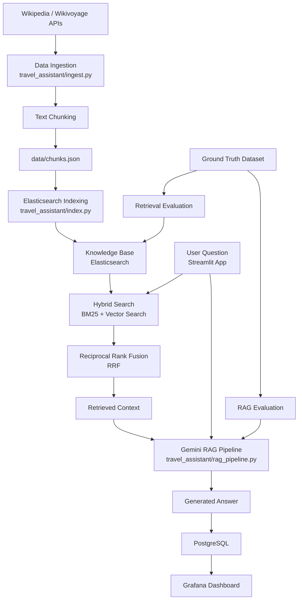
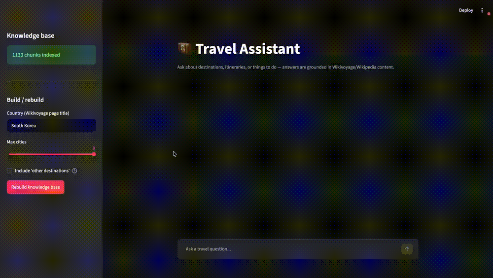
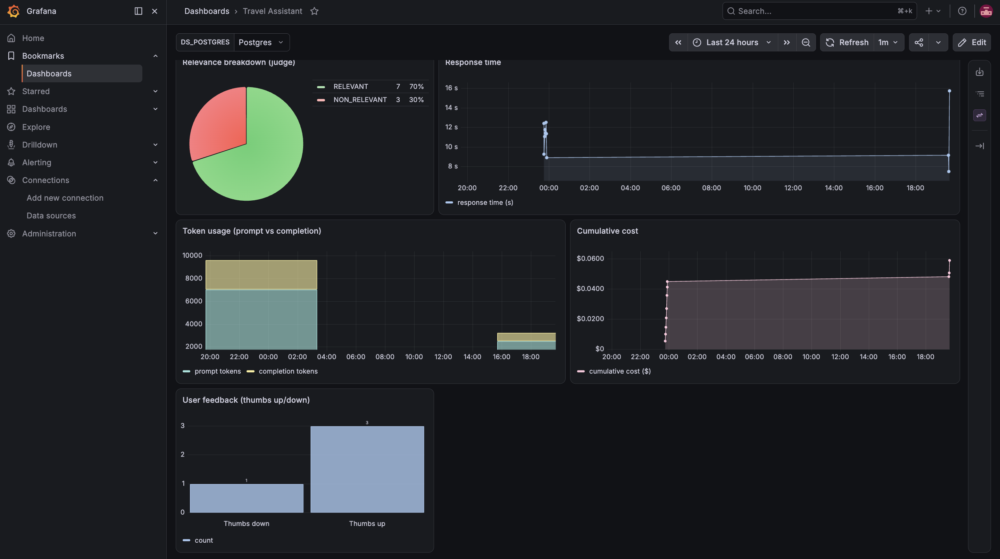

# Travel Assistant


This project is a Retrieval-Augmented Generation (RAG) travel assistant that collects travel information from Wikipedia and Wikivoyage, builds a searchable knowledge base, and uses Google Gemini to answer travel-related questions.

## Problem Statement
Planning a trip often requires searching through scattered information from multiple sources. Travelers may struggle to find accurate and relevant details about destinations, transportation, attractions, and local experiences. This project combines user questions, travel knowledge from Wikipedia and Wikivoyage, and RAG-based retrieval to provide context-aware travel assistance.

## System Overview
- **Knowledge Base Creation**: Ingests travel information from live APIs, processes documents into chunks, and indexes them in Elasticsearch.

- **Retrieval and Generation**: Uses hybrid search (BM25 and vector search) with RRF to retrieve relevant context and Gemini to generate answers.

- **Evaluation**: Includes retrieval evaluation and end-to-end RAG evaluation to select the best retrieval strategy and model configuration.

- **User Interface**: Provides interactive access through a Streamlit web application.

- **Monitoring and Storage**: Uses Grafana for monitoring dashboards and PostgreSQL for conversation history and evaluation result storage.


## Project Flow


- The system first builds a travel knowledge base from Wikipedia and Wikivoyage data.  
- Retrieval methods and Gemini models are evaluated to select the best RAG configuration.  
- Users can then ask travel questions through Streamlit, where relevant information is retrieved from Elasticsearch and Gemini generates context-aware answers.   
- Conversation data and system metrics are stored in PostgreSQL and monitored through Grafana.

## Project Structure
```text
travel-rag-assistant/
├── data/                         # Knowledge base chunks and generated datasets
├── db/                           # PostgreSQL database operations
│   ├── db_init.py                # Database initialization
│   ├── db_save.py                # Save conversations and evaluation data
│   ├── db_query.py               # Query stored records
│   └── db_feedback.py            # Store user feedback
├── eval/                         # Retrieval and RAG evaluation scripts
│   ├── evaluate_retrieval.py
│   ├── evaluate_rag.py
│   ├── generate_ground_truth.py
│   ├── retrieval_evaluation.md
│   └── rag_evaluation.md
├── grafana/                      # Grafana provisioning and dashboard configuration
├── images/                       # README images and demo GIFs
├── travel_assistant/             # Core RAG application code
│   ├── ingest.py                 # Data ingestion and chunking
│   ├── index.py                  # Elasticsearch indexing
│   ├── search_engine.py          # BM25, vector, and hybrid search
│   └── rag_pipeline.py           # RAG workflow and Gemini integration
├── app.py                        # Streamlit application
├── main.py                       # Application entry point
├── docker-compose.yml            # Docker services configuration
├── Dockerfile                    # Streamlit application image
├── pyproject.toml                # Python project dependencies
├── uv.lock                       # Locked dependency versions
├── .env                          # Environment variables
└── README.md                     # Project documentation
```


## How to set up
1. Clone the project:
```bash
git clone <repo-url>
cd travel-rag-assistant
```

2. Create a Gemini API key and add it in [.env](.env).
```
GEMINI_API_KEY=your-gemini-api-key
```
3. Create docker application:
```bash
docker compose up --build
```

Docker Compose will build the Streamlit image, create a dedicated Docker network, and start four containers:

- Elasticsearch – stores and searches the knowledge base.
- PostgreSQL – stores conversation history and evaluation results.
- Grafana – provides monitoring dashboards.
- Streamlit – hosts the travel assistant web application.

To run the containers in the background, use:

```bash
docker compose up -d --build
```
> **Note**: Keep all containers in the Up state while following the remaining steps in this guide, as they depend on these services being available.


To stop the application:

```bash
docker compose down
```

## Creating Custom Dataset
A custom dataset for the knowledge base has already been created and stored at [data/chunks.json](data/chunks.json) for **South Korea**.

To reproduce the existing dataset (or) create a new dataset for another country, run:

```bash
docker compose exec streamlit python travel_assistant/ingest.py --country="South Korea"
```
--country argument can be changed to any supported country name used by Wikipedia or Wikivoyage.


## Evaluation
The retrieval component and the full RAG pipeline are evaluated to determine the best configuration for the final system.

Check below markdown files for each evaluation:
- [Retrieval Evaluation](eval/retrieval_evaluation.md)
- [RAG Evaluation](eval/rag_evaluation.md)  

## System Testing with Streamlit
The travel assistant can be tested through a Streamlit web interface that provides an interactive experience with the complete RAG pipeline.

Users can:
- Build a knowledge base for the desired country.
- Ask travel-related questions.
- View response metadata, including latency, token usage, cost estimation, and answer evaluation.
- Provide feedback on generated answers.

The backend stores conversation details in PostgreSQL for monitoring and analysis.

Streamlit is automatically configured through Docker Compose. Open the Streamlit interface in your browser:
```
http://localhost:8501
```


> **Note:** Building the knowledge base may take a few minutes, as the system needs to ingest, chunk, and index travel data before it can answer questions. 


## Monitoring with Grafana
The system includes Grafana dashboards for monitoring the travel assistant performance and usage metrics.

The dashboard connects to PostgreSQL and visualizes:

- **Answer relevance**: Distribution of evaluator judgments (`RELEVANT`, `PARTLY_RELEVANT`, `NON_RELEVANT`).

- **Response time**: Latency of each user query.

- **Token usage**: Prompt and completion token consumption over time.

- **Cost tracking**: Cumulative Gemini API cost.

- **User feedback**: User ratings from thumbs up/down feedback.

Grafana is automatically configured through Docker Compose.
Once the services are running, access the dashboard at:

```bash
http://localhost:3000/d/travel-assistant
```
You can open both the Streamlit application and Grafana dashboard simultaneously in separate browser tabs.

The dashboard contains five charts that update as more conversations are processed through the Streamlit application.




## Limitations

Although the Travel Assistant provides context-aware travel answers using RAG, it has several limitations:

- **Knowledge Coverage:** The system can only answer based on information available in the knowledge base collected from Wikipedia and Wikivoyage. It may not know recent changes that are not included in these sources.

- **Real-Time Information:** The system does not provide real-time updates for information such as opening hours, prices, transportation schedules, or travel restrictions.

- **Answer Accuracy:** Generated answers depend on the quality of retrieved documents and Gemini's response generation. Incorrect or incomplete retrieved information may lead to less accurate answers.

- **Evaluation Dataset Size:** The evaluation uses a limited ground-truth dataset generated from selected knowledge chunks, so it may not represent all possible travel questions.

- **Language Support:** The current system is primarily designed for English travel queries and may not perform equally well for other languages.

- **Cost and Latency:** Each answer requires search and Gemini generation, which introduces response latency and API usage costs.
